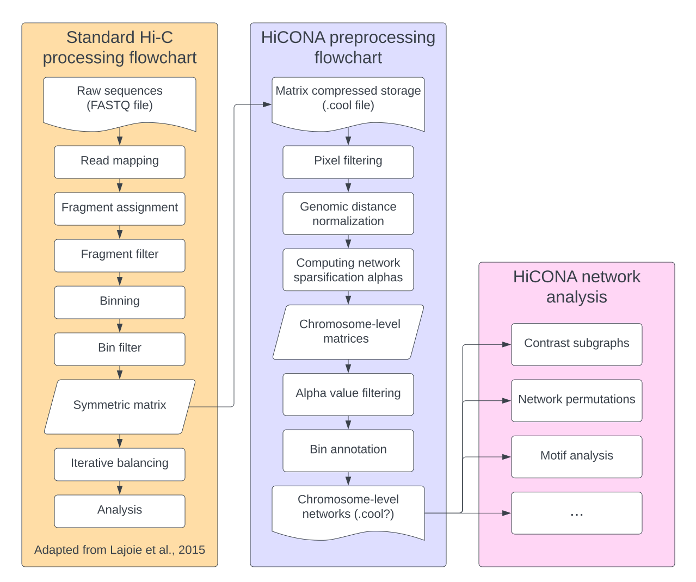

.. 
   TODO: Maybe add shields.io badges like Squidpy 

HiCONA - Hi-C Organization Network Analysis
===========================================
A simple and efficient framework for network analysis of Hi-C data using 
Python3.

    Package schematic (this is just a placeholder image)

..
   TODO: make actual image 

About
-----
**HiCONA** is a Python3 package whose aim is to provide the tools to perform 
network analysis on Hi-C contact matrices. A Hi-C contact matrix is in fact
an adjacency matrix, and thus a natural representation for a graph, but 
despite this fact it is hardly ever used as such. This is mostly due to 
how difficult it can be to handle these huge sparse matrices. 

HiCONA tries to address these needs by building on top of two main packages:

* `Cooler`_ for I/O and storage related tasks
* `graph-tool`_ for graph processing and plotting

HiCONA adheres as much as possible to the cooler format specifications,
striving to maintain full compatibility and the ability to be integrated with
other tools. Moreover HiCONA implements other algorithms, especially for 
preprocessing, optimized for both computational and memory efficiency.

Development
-----------
If you want to request new features, leave your opinion, report bugs,
contribute, or simply follow package development, see the main repository on
`GitHub`_.

Citing
------
*As of yet, there are no publications on HiCONA.*

.. toctree::
   :maxdepth: 1
   :hidden:
   
   installation
   api
   tutorials
   references

.. _Cooler: https://github.com/open2c/cooler
.. _graph-tool: https://graph-tool.skewed.de/
.. _GitHub: https://github.com/leomorelli/HiCONA/
