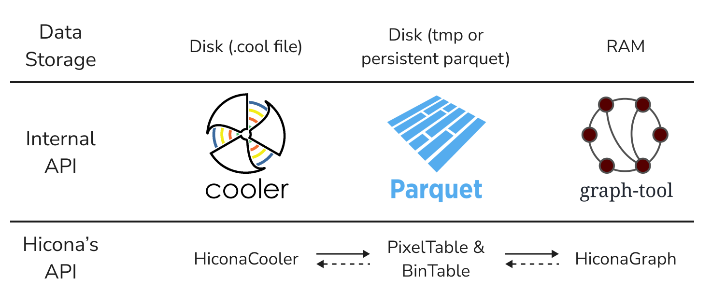

Implementation
==============

Main classes
------------

HiCONA revolves around three main classes: :py:class:`HiconaCooler`, :py:class:`PixelTable`
and :py:class:`HiconaGraph`.
These classes can be seen as different representations of the same data, each with a
format and a way to handle memory optimized for a certain set of operations.

HiconaCooler
------------

:py:class:`HiconaCooler` is the `storage` class. It inherits from :py:class:`cooler.Cooler`,
meaning that an instance of :py:class:`HiconaCooler` can always be used in place of an
instance of :py:class:`cooler.Cooler`. For this reason, when interfacing with this class,
the data is backed by a ``.cool`` file (or ``.mcool`` or ``.scool``). This type of storage
is ideal when you need to iterate the entire pixel table or a portion of it as long as it
is composed of `contiguous` pixels.

The main additions provided by :py:class:`HiconaCooler`, with respect to
:py:class:`cooler.Cooler`, are in terms of bin annotation. :py:class:`HiconaCooler` allows to
add different types of bin annotations, such as genomic elements (genes, promoters...) and
chromatin states (`chromHMM`, for instance). These annotations are permanently stored in the
``.cool`` file.

PixelTable
----------
A :py:class:`PixelTable` is another tabular representation of the pixels, just like
:py:class:`HiconaCooler`, though the data is not backed by a ``.cool`` file but rather a
copy of (part of) it saved in a partitioned ``.parquet`` storage.
Basically, the :py:class:`PixelTable` instance handles a folder containing pixel chunks in
individual binary files. By default, this folder is placed within the temporary directory of your
system (``/tmp/`` if you are on Linux) and it is deleted when the program exits (regardless of exit code).
All this together results in a temporary storage with quick and easy
data manipulation of a specific subset of pixels, regardless of their position in the original
``.cool`` file. Moreover, the original ``.cool`` file is not modified and the disk
is not occupied by copies of your data (unless you explicitely ask for it).

Each :py:class:`PixelTable` is associated with an instance of :py:class:`BinTable`. As you
might expect, :py:class:`BinTable` works similarly to :py:class:`PixelTable` but for bin data.
Although :py:class:`BinTable` is a standalone class, in most cases you will not interface
directly with an instance of it; while working with a :py:class:`PixelTable` instance, this
object will use the associated :py:class:`BinTable` instance internally. For this reason,
:py:class:`BinTable` is not discussed estensively throughout the documentation and might
even be fully incorporated in :py:class:`PixelTable` in the future.

HiconaGraph
-----------
:py:class:`HiconaGraph` is the class which handles an actual graph representation of your
data. This representation is an instance of :py:class:`graph_tool.Graph`, where the vertices
correspond to the bins and the edges to the pixels. All information on bins and pixels,
annotations included, is added to the graph in the form of vertex and edge properties,
respectively.

:py:class:`HiconaGraph` does not inherit from :py:class:`graph_tool.Graph`:
this is because the API of :py:mod:`graph_tool` can be quite overwhelming if you are not
used to it. Instead, :py:class:`HiconaGraph` stores the instance of
:py:class:`graph_tool.Graph` in an attribute (``.graph``). This way,
:py:class:`HiconaGraph` can provide a simplified, reduced and specialized API, while
still allowing to access the complete :py:mod:`graph_tool` API when needed. Manipulating
directly the :py:class:`graph_tool.Graph` instance does not invalidate the
:py:class:`HiconaGraph` instance since the latter does not store any information itself,
it is just a wrapper which fetches the required data on request.

Class Conversion
----------------
